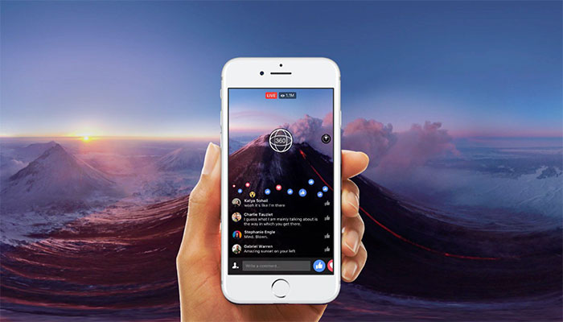
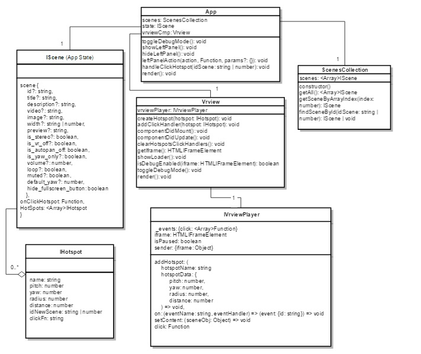

<p align="center"></p>

# <p align="center">VRVIEW React</p>

<b><p align="center">React Component for virtual tour creation</p></b>

- It encapsulates <a href="https://developers.google.com/vr/concepts/vrview" target="_blank">Google's Vrview Library</a>
- It is posible to define points (aka hotspots) to navigate between images/videos
- It is posible to assign an arbitrary function to a hotspot click event
- Using a smartphone and <a href="https://vr.google.com/cardboard/" target="_blank">Google's Cardboard</a>
  or other specialized hardware it is posible to have a full and inmersive virtual reality expereince
- <a href="https://yagolopez.js.org/vrview-react/build/" target="_blank">DEMO full screen (for mobile)</a>
- <a href="http://mobiletest.me/htc_one_emulator/?u=https://yagolopez.js.org/vrview-react/build/"
  target="_blank">DEMO in simulator (for desktop)</a> <b>Warning: </b> Javascript in external iframes might have restrictions
  for security reasons. Run the full scren demo to avoid restrictions.
  - Note: the demo uses Fabric UI Framework from Microsoft

## Requirements
- Node/npm/yarn
- A project created with Create-React-App for Typescript. If you don't want to use Typescript you must erase all
  type information manually.

## Installation

- To install in a existing `Create-React-App` project, run `nmp install --save YagoLopez/vrview-react`
- To copy and run this project:
  - Clone or fork this repository
  - Install dependencies: `npm install` inside your local directory project
  - Run the application: `npm run start`

## Application Programming Interface

```reactjs
<Vrview {...scene} />
```

Vrview is a prure component. It receives scene data as props from a parent component. It asigns that props to its state
which implements the following interface:

```typescript
export interface IScene {
  scene: {
    id: number | string,
    title?: string,
    description?: string,
    video?: string,                   // URL pointing to a 360° video file or an adaptive streaming
                                      // manifest file (.mpd or .m3u8).
    image?: string,                   // URL pointing to a 360° image file. Exactly one video or image is required.
                                      // Images and videos must be in /public directory
    width?:	string | number,          // Iframe's width attribute.
    height?:	string | number,        // Iframe's height attribute.
    preview?:	string,	                // URL to a preview image for a 360º scene (video/image).
    is_stereo?:	boolean,	            // Indicates whether the content has stereo format or not.
    is_debug?:	boolean,	            // Turns on/off debug canvas features (like showing the FPS meter).
    is_vr_off?:	boolean,	            // Enables/disables the VR mode button.
    is_autopan_off?: boolean,	        // Enables/disables the autopan introduction on desktop.
    is_yaw_only?:	boolean,	          // When true, prevents roll and pitch. This is intended for stereo panoramas.
    volume?: number,                  // The initial volume of the media; it ranges between 0 and 1; zero equals muted.
    loop?: boolean,                   // Enable/disable the loop in the video
    muted?: boolean,                  // Mutes/unmutes the sound of the video
    default_yaw?:	number,	            // Numeric angle in degrees of the initial heading for scene.
                                      // By default, the camera points at the center of the image.
    hide_fullscreen_button?: boolean  // When true, the fullscreen button contained inside the VR View iframe will
                                      // be hidden. This parameter is useful if the user wants to use VR View's fullscreen
                                      // workflow (via vrView.setFullscreen() callback) with an element outside the iframe.
  },
  onClickHotspot?: Function,          // Click event handler for a hotspot
  hotspots?: Array<IHotspot>          // Array of clickable points on scene
}
```

A scene can have 0 or more hotspots of type `IHotspot`:

```typescript
export interface IHotspot {
  name: string,                   // Hotspot identifier. Used on click event
  pitch: number,                  // The latitude of center, specified in degrees, between -90 and 90, with 0 at the horizon.
  yaw: number,                    // The longitude of center, specified in degrees, between -180 and 180, with 0 at the image center.
  radius: number,                 // The radius of the hotspot, specified in meters.
  distance: number                // The distance of the hotspot from camera, specified in meters.
  idNewScene?: number | string    // Destination scene for on click event
  clickFn?: string                // Arbitrary function to run on hotspot click event. (Function call must be string
                                  // to be valid JSON)
}
```

## Use

- Static assets like images and videos must go in `public` directory
- Copy `public/vrview` folder to your project `public` folder
- Import `Vrview` component from `node_modules/vrview-react/src/vrview`
- Define a scene in json format and pass it to `VrviewCmp` component as props. Each scene follows the interface `IScene`.
  For example, for a simple scene:

```javascript
scene: IScene = {
  scene: {width: '90%', height: 400, image: '../images/coral.jpg', is_stereo: true, is_debug: true}
}
```

- To create a virtual tour with several scenes you can define an array of scenes. To navigate from one
  scene to another define a hotspot and a relation with other scene using "idNewScene" as external key (like in a
  relational database). In this demo it has been used the Repository Pattern and a `SceneCollection` Class that loads
  and manages the scenes from a `scenes.json` file but this data could be loaded from an external API.

```javascript
[{
  "scene":
  {
    "id": 1,
    "width": "100%",
    "height": 400,
    "image": "../images/coral.jpg",
    "is_stereo": true,
    "is_debug": true,
    "title": "Title Scene 1",
    "description": "Initial scene with three hotspots. One hotspot has a new scene associated, other has no new scene and the third executes a function"
  },
  "hotspots": [
    {"name": "scene1-hotspot1", "pitch": 0, "yaw": 0, "radius": 0.05, "distance": 2, "idNewScene": 2},
    {"name": "scene1-hotspot2", "pitch": 0, "yaw": -35, "radius": 0.05, "distance": 2},
    {"name": "scene1-hotspot3", "pitch": -20, "yaw": -25, "radius": 0.05, "distance": 2,
      "clickFn": "alert('Function executed');"}
  ]
},
 {
   "scene":
   {
     "id": 2,
     "image": "../images/landscape1.jpg",
     "is_stereo": false,
     "title": "Title Scene 2",
     "description": "Scene 2 has two hotspots with respectives scenes associated"
   }
 }]
```


- Each time the user clicks a hotspot a new scene is loaded from `ScenesCollection` and passed from `App`
  component to `VrviewCmp` as props and `VrviewCmp` set its state from the incoming props with the new scene data.

- Hotspots are optional and you can also define an arbitrary function for a hotspot click event.
  For example, in the following case instead of defining a `idNewScene` object just define the `clickFn` property:

```javascript
{
  scene: {image: '../images/walrus.jpg', is_stereo: true},
  hotspots: [
    {name: 'hotspot5', pitch: -20, yaw: -25, radius: 0.05, distance: 2, clickFn: '() => alert("Function executed")'}
  ]
}
```

## UML Diagram of the Demo
<p align="center"></p>

# Disclaimer
At the moment it seems IE < 11 and some IOS can experiment malfunction with three.js library. Feel free to open an issue

License MIT

<a href="#">Return to top</a>